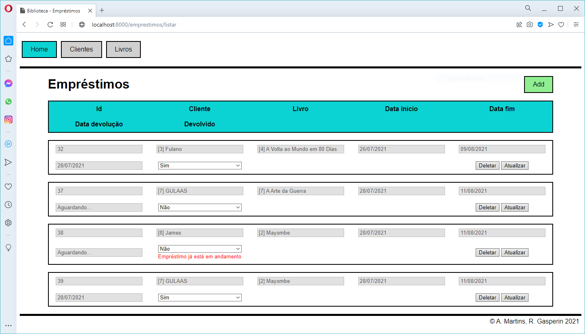

# ProjetoPDWEL
Projeto da disciplina PDWEL (Programação Dinâmica para Web), que consiste em um simples sistema Web para controle de empréstimo de livros de uma biblioteca, implementado em PHP com o *framework* Laravel.

Alunos:

Adriana Martins - SP3015572

Rodrigo Gasperin - SP3014142

Professor: Ugo Silva

TADS - IFSP - 2021/1



# Intruções de *deployment*
## 1. Ambiente
 - Instalar PHP + Composer + Node + SGBD (pref. MySQL)
    - descomentar as extensões *fileinfo* e *pdo_mysql*, no arquivo **php.ini**
 - Criar a base de dados **biblioteca**, no SGBD
 - Configurar a conexão com SGBD no **.env**; exemplo:
```sh
DB_CONNECTION=mysql
DB_HOST=127.0.0.1
DB_PORT=3306
DB_DATABASE=biblioteca
DB_USERNAME=${USER}
DB_PASSWORD=${PASS}
```

## 2. *Build & deploy*
 - Clonar o repositório e acessar a pasta do projeto:
```sh
$ git clone https://github.com/r-gasperin/ProjetoPDWEL.git
$ cd ProjetoPDWEL/biblioteca
```
 - Instalar as dependências do Composer e do Node, e compilar os *Assets*:
```sh
$ composer install
$ npm install
$ npm run dev
```
 - Executar as *migrations* e rodar o projeto:
```sh
$ php artisan migrate
$ php artisan serve
```
 - No navegador, acessar o endereço:
```sh
localhost:8000
```

# Enunciado do Projeto Final:

Vocês deverão implementar uma aplicação Web a ser entregue até o dia 04/08/21.
Pode ser uma demanda pessoal ou profissional que você tenha.
Pode ser feito em grupos com no máximo 4 integrantes, pode usar o framework MVC de sua preferência.

Requisitos mínimos:

 - Acesso a dados (CRUD)
 - MVC
 - Responsiva

Você deve criar um projeto no GitHub com a descrição do projeto e a equipe integrante na página inicial, instruções de deployment.
